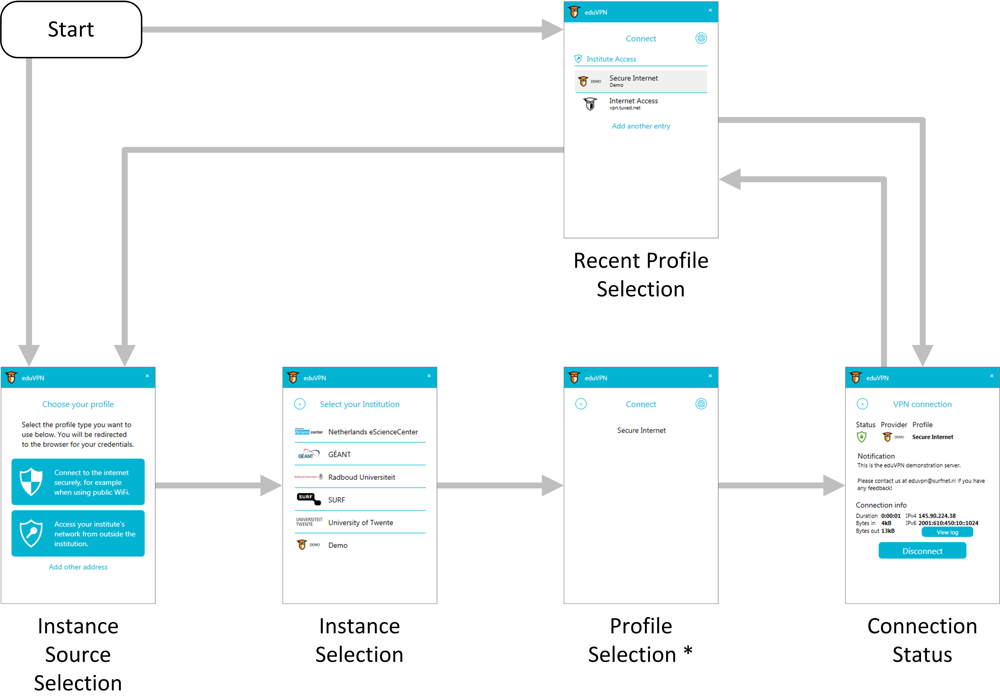
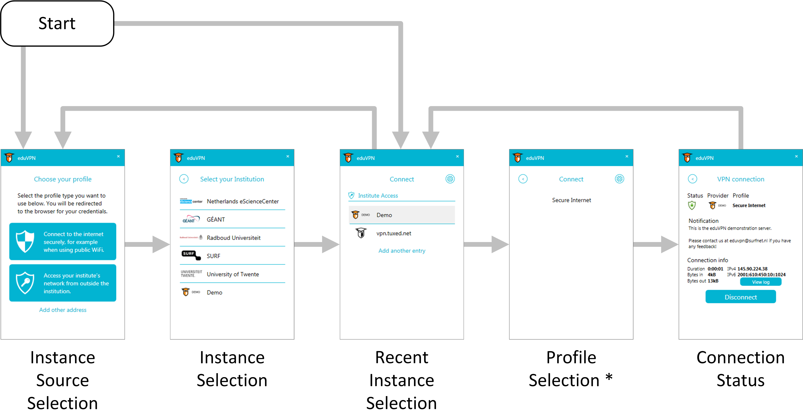
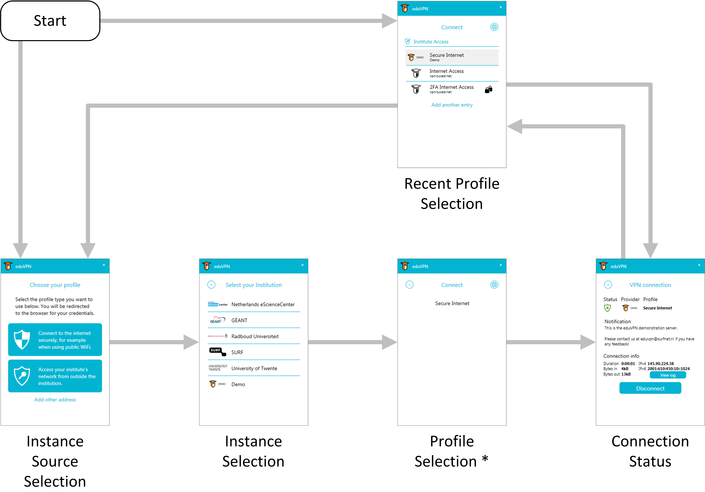
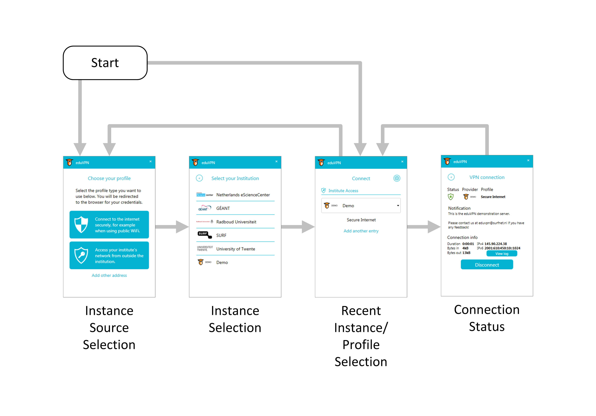

# ConnectingProfileSelectMode - Client Profile Management Mode

According to the [#28](https://github.com/Amebis/eduVPN/issues/28) four distinct modes of client operation were introduced. They are labelled as 0 (default), 1, 2, and 3. The mode affect behaviour of locally authenticated instance sources only (Institute Access).

The mode of operation can be set in `eduVPN.Client.exe.config` XML file. When changing mode, the client should be closed. Furthermore, it is recommended to delete client user settings in `%LOCALAPPDATA%\SURF` when the mode is changed.

1. If not already present, add the following element to `<configSections>`:

```XML
<sectionGroup name="applicationSettings" type="System.Configuration.ApplicationSettingsGroup, System, Version=4.0.0.0, Culture=neutral, PublicKeyToken=b77a5c561934e089" >
    <section name="eduVPN.Properties.Settings" type="System.Configuration.ClientSettingsSection, System, Version=4.0.0.0, Culture=neutral, PublicKeyToken=b77a5c561934e089" requirePermission="false" />
</sectionGroup>
```

2. If not already present, add the following element to `<configuration>`, or merge it with the existing:

```XML
<applicationSettings>
    <eduVPN.Properties.Settings>
        <setting name="ConnectingProfileSelectMode" serializeAs="String">
            <value>2</value>
        </setting>
    </eduVPN.Properties.Settings>
</applicationSettings>
```

Change `<value>2</value>` accordingly.


## Mode 0



Only the profiles user connects to are added to the list of recent profile selection. The list of recent profile selection is maintained automatically. The user can remove profiles from the list using the context menu.

This mode is the compacter form of [Mode 2](#mode-2).

Cons:
- Users will not notice newly available profiles.
- The client needs to load `/profile_list` from all recently connected instance on startup to see whether any profile is no longer available.


## Mode 1



The user manages the list of recent instance selection manually. The user can add new instances using the standard procedure, and remove them using the context menu.

To connect, the user selects the instance from the list. The profile selection page is displayed for specific instance next, where the user selects the profile to connect to.

Pros:
- `/profile_list` is loaded on demand. Client startup is faster.

Cons:
- The user needs an extra step to connect. However, profile selection could be ommited when instance has only one profile.


## Mode 2



All profiles of instances user connects to are added to the list of recent profile selection. This allows the list to grow when new profiles are added to the connecting instances later.

This mode is the extended form of [Mode 0](#mode-0).

Cons:
- The client needs to load `/profile_list` from all recently connected instance on startup to prepare the list of profiles.
- The list might grow quite long, should the user connect to a lot of instances and/or some instances having a lot of profiles to connect to.


## Mode 3



The user manages the list of recent instance selection manually. The user can add new instances using the standard procedure, and remove them using the context menu.

To connect, the user selects the instance from the drop-down list. Next, the list of available profiles is displayed below, where the user selects the profile to connect to.

Pros:
- The experience is the same as with other instance source types (Secure Internet)
- `/profile_list` is loaded on demand. Client startup is faster.

Cons:
- The user needs three clicks to change the instance and select the profile to connect to.
- When Secure Internet and Institute Access are displayed on the same page simultaneously, the UI gets crammed.
